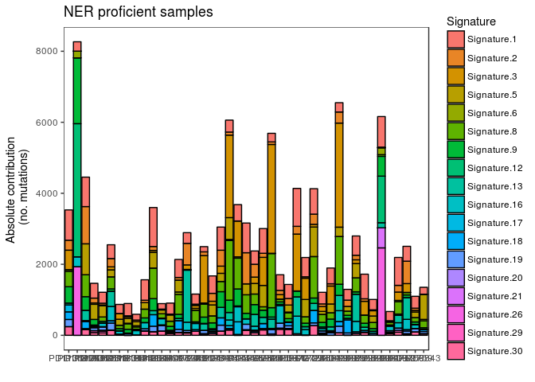

Data
====

The original dataset consists of 569 WGS breast cancer samples (tumor & normal samples) (four of them from men) from (Nik-Zainal et al. 2016) available via ICGC. In (Nik-Zainal et al. 2016), a subset of 560 samples is used, with extensive additional information given in supplementary tables. Copy number variation data from a SNP array is available for 344 of them. This is the subset used here.

Small somatic variants (SNVs and small INDELs)
----------------------------------------------

For all samples, the consequences of the mutations are annotated in the ICGC data.

The following variant types are found in repair genes, and the ones in bold are considered loss-of-function mutations. The ones in italic are considered as very likely having no effect. The remaining ones have unclear effect.

-   3\_prime\_UTR\_variant
-   5\_prime\_UTR\_premature\_start\_codon\_gain\_variant
-   5\_prime\_UTR\_variant
-   **disruptive\_inframe\_deletion**
-   *downstream\_gene\_variant*
-   exon\_variant
-   **frameshift\_variant**
-   inframe\_deletion
-   *intron\_variant*
-   missense\_variant
-   splice\_acceptor\_variant
-   splice\_donor\_variant
-   splice\_region\_variant
-   **stop\_gained**
-   stop\_retained\_variant
-   synonymous\_variant
-   *upstream\_gene\_variant*

(Other annotated variants that are not found in the repair genes are: disruptive\_inframe\_insertion, inframe\_insertion, initiator\_codon\_variant, intergenic\_region, intragenic\_variant, start\_lost, stop\_lost. )

(I don't know what an exon\_variant is, since missense, nonsense and synonymous variants are annotated separately. )

Copy number variation
---------------------

Copy number variation is available for 344 samples and all Pearl repair genes except GTF2H5 (NER), RDM1 (HR) and RECQL4 (HR). It is not clear why. One possible explanation is that these genes lie be in regions with too few SNPs to call CNVs.

CNV was measured using an Affymetrix SNP6.0 array and CNVs were called with the ASCAT algorithm. The results are reported incompletely in the ICGC data (there are some empty columns, e. g. copy numbers, quality scores). The raw data is available from the European Genome-Phenome arxive with accession number EGAD00010000915.

ASCAT takes aneuploidy (aberrations from the diploid state of a healthy cell) and admixture with non-tumor cells into account. First, segments with baseline copy numbers are determined (fitting constants), and an integer is output as the segment mean. Subsequently, copy numbers per SNP (or for a set of subsequent SNPs) are estimated, and mutation types are called based on this.

More details: <https://www.crick.ac.uk/peter-van-loo/software/ASCAT> \[Van Loo et al. (2010), Van Loo et al. (2012).

The following mutation types are called (details from the supplementary information of (Van Loo et al. 2010)).

-   copy neutral
-   copy neutral LOH (this means LOH compared to the biallelic reference, i. e. the healthy control tissue)
-   gain (SNPs with total copy number &gt;=3)
-   loss (SNPs with total copy number 0 or 1)

The results are not summarized per SNP, but rather per segment or set of SNPs. There can be multiple copy number events per gene per sample. In practice, it's in most cases maximum 1 event, sometimes 2 and in rare cases 3 or 4 events per gene. I am only considering the most severe event per gene.

Recoding:

-   copy neutral, copy neutral LOH, gain =&gt; 2 (neutral or gain)
-   loss with segment mean = 0 =&gt; 0 (loss of both alleles)
-   loss with segment mean = 1 =&gt; 1 (loss of one allele)
-   loss with segment mean &gt;=2 =&gt; 2 (unclear, but might not be a loss after all)

NER deficiency vs proficiency
-----------------------------

A repair gene is considered deficient, if at least

-   2 LOF mutations
-   1 LOF mutation and 1 copy number loss
-   2 copy number losses or one complete loss

have occurred within the gene. A sample is considered NER deficient, if at least one NER gene is deficient. 66 NER related genes described in (Pearl 2015) are used.

A repair gene is considered proficient, if no deletion and no small mutations, except for the ones with no effect, have occurred. A sample is considered NER proficient, if all its NER genes are proficient.

Mutation counts
---------------

SNV counts were prepared by Qianyun Guo for (Juul et al. 2018), as described in (Bertl et al. 2018). In addition to the 96 strand-symmetric mutation types, they also contain annotations of genomic segment types ("3utr" "5utr" "cds" "prom" "ss" and NA=intergenic), replication timing (5 bins, measured on HeLa cell lines, Chen et al) and expression level (5 bins for genic regions, TCGA breast cancer data).

Then, I fitted the 30 COSMIC signatures with the function fit\_to\_signatures from the R-package MutationalPatterns (Blokzijl et al. 2018).

Data preparation
================

The data was retrieved from the ICGC (somatic copy number variation, simple somatic mutations and sample information) and was further prepared R scripts are used to prepare the data. The original files are copy\_number\_somatic\_mutation.tsv, donor.tsv, sample.tsv and simple\_somatic\_mutation.open.tsv.

**Basics:**

-   prepare\_samples.R: list with mapping of sample and donor IDs and which information is available (CNV, SNV). Output: BRCA\_samples.Rdata

\*\*Preparation of the raw mutation <data:**>

-   subset\_cnvs.R: subsets the original data to the genomic regions of the repair genes. Output: cnv\_subset.Rdata
-   prepare\_CNV\_in\_repair\_genes.R: extracts copy number variation data per sample per repair gene from cnv\_subset.Rdata. Output: BRCA\_cnv\_in\_repair\_genes.Rdata
-   subset\_simple\_somatic\_mutations.R: subsets somatic mutation files to the genomic regions of the repair genes. Output: snv\_subset.Rdata
-   prepare\_mutations\_in\_repair\_genes.R: extracts different mutation types (consequences) per repair gene and sample from snv\_subset.Rdata. Output: BRCA\_mutations\_in\_repair\_genes.Rdata

**Definition of repair deficiencies:**

-   prepare\_LOF\_mutations\_in\_repair\_genes.R: extracts the number of loss-of-function mutations per repair gene per sample. Output: BRCA\_lof\_in\_repair\_genes.Rdata
-   prepare\_double\_hits\_in\_repair\_genes\_pathways.R: defines double hits (biallelic inactivation) per sample per repair gene and summarizes over repair pathways. Output: BRCA\_double\_hits\_genes\_pathways.Rdata
-   prepare\_no\_hit\_in\_repair\_genes\_pathways.R: defines functional repair genes per sample per repair genes and summarizes over repair pathways. Output: BRCA\_no\_hits\_in\_repair\_genes\_pathways.Rdata

**Mutational signatures:**

-   prepare\_mutation\_counts.R: Prepares the counts of the 96 mutation types per sample. Output: BRCA\_mutation\_counts.Rdata
-   prepare\_COSMIC30\_signatures: fits the 30 COSMIC signatures to the mutation counts

\*\*Samples with CNV and SNV <data:**>

-   prepare\_subset344.R. Subsets to the 344 samples where copy number data is available: BRCA344\_COSMIC30\_mutational\_signatures.Rdata, BRCA344\_double\_hits\_genes\_pathways.Rdata, BRCA344\_mutation\_counts.Rdata, BRCA344\_no\_hits\_in\_repair\_genes\_pathways.Rdata -- These are the final datasets analysed here.

**Summary files:**

The main analyses presented in the paper can be conducted based on the files mutation\_counts.txt and NER\_functionality\_category.txt. They are produced here. The test results are available in results.txt.

Results
=======

Samples with NER proficiency and deficiency
-------------------------------------------

### Number of double hits per NER gene

    ##    CDK7   CETN2    CUL3   CUL4A    CUL5    DDB1    DDB2   ERCC1   ERCC2 
    ##       2       0       1       2       4       0       1       0       1 
    ##   ERCC3   ERCC4   ERCC5   ERCC6   ERCC8 GADD45A GADD45G  GTF2H1  GTF2H2 
    ##       0       0       2       0       2       0       0       1       1 
    ##  GTF2H3  GTF2H4  GTF2H5    LIG1    LIG3   MNAT1    PCNA   POLD1   POLD2 
    ##       2       0      NA       0       0       0       0       0       0 
    ##   POLD3   POLD4    POLE   POLE2   POLE3   POLE4    POLK  POLR2A  POLR2B 
    ##       0       0       0       0       0       0       1       2       0 
    ##  POLR2C  POLR2D  POLR2E  POLR2F  POLR2G  POLR2H  POLR2I  POLR2J  POLR2K 
    ##       1       0       1       2       1       1       0       2       0 
    ##  POLR2L  RAD23A  RAD23B    RBX1    RFC1    RFC2    RFC3    RFC4    RFC5 
    ##       0       2       0       2       2       1       2       1       0 
    ##    RPA1    RPA2    RPA3    RPA4   TCEB1   TCEB2   TCEB3   UVSSA    XAB2 
    ##       5       1       0       0       1       0       3       1       1 
    ##     XPA     XPC   XRCC1 
    ##       0       0       1

Note that there are no double hits in XPC and ERCC1.

POLE, which can cause a mutator phenotype if knocked out (mainly seen in colorectal cancer), does not have any double hits. This matches with signature 10 not being used here.

For GTF2H5, the copy number data is missing.

### Number of NER proficient and deficient samples and samples with unclear NER function

    ## category
    ##     def     pro unknown 
    ##      27      43     274

Mutational signatures
---------------------

With a cut-off of 0.1, 18 mutational signatures were used to fit the data. This includes all 12 signatures used in Nik-Zainal et al (1, 2, 3, 5, 6, 8, 13, 17, 18, 20, 26, 30) and additional signatures 9, 12, 16, 19, 21 and 29.

### Goodness-of-fit

All samples have a high cosine similarity, so no samples are excluded from the analysis.

### Signature contributions

### Correlation between signature contribution (absolute) and total number of mutations

Only the proficient and deficient samples are considered here. The Spearman correlation is used.

    ## Warning in cor(BRCA344_total_mutation_counts
    ## $total_count[BRCA344_total_mutation_counts$Donor_ID %in% : the standard
    ## deviation is zero

(The correlation can't be computed for signature 20, because it is zero. )

### Correlation between signature contributions (absolute)

Only the proficient and deficient samples are considered here. The Spearman correlation is used.

(red, positive; blue, negative)

    ## [1] ""

The highest correlations are between Signature 2 and 13 (both APOBEC related, often found together) and Signature 3 and 13.

Mutational footprint of NER deficiency
--------------------------------------

### Mutation profiles

### Total number of mutations

### Signature profiles

    ## Warning in contribution * total_signatures: longer object length is not a
    ## multiple of shorter object length

    ## Warning in contribution * total_signatures: longer object length is not a
    ## multiple of shorter object length

    ## Warning in wilcox.test.default(x = sig_def, y = sig_pro, conf.int = T):
    ## cannot compute exact p-value with ties

    ## Warning in wilcox.test.default(x = sig_def, y = sig_pro, conf.int = T):
    ## cannot compute exact confidence intervals with ties

    ## Warning in wilcox.test.default(x = sig_def, y = sig_pro, conf.int = T):
    ## cannot compute exact p-value with ties

    ## Warning in wilcox.test.default(x = sig_def, y = sig_pro, conf.int = T):
    ## cannot compute exact confidence intervals with ties

    ## Warning in wilcox.test.default(x = sig_def, y = sig_pro, conf.int = T):
    ## cannot compute exact p-value with ties

    ## Warning in wilcox.test.default(x = sig_def, y = sig_pro, conf.int = T):
    ## cannot compute exact confidence intervals with ties

    ## Warning in wilcox.test.default(x = sig_def, y = sig_pro, conf.int = T):
    ## cannot compute exact p-value with ties

    ## Warning in wilcox.test.default(x = sig_def, y = sig_pro, conf.int = T):
    ## cannot compute exact confidence intervals with ties

    ## Warning in wilcox.test.default(x = sig_def, y = sig_pro, conf.int = T):
    ## cannot compute exact p-value with ties

    ## Warning in wilcox.test.default(x = sig_def, y = sig_pro, conf.int = T):
    ## cannot compute exact confidence intervals with ties

    ## Warning in wilcox.test.default(x = sig_def, y = sig_pro, conf.int = T):
    ## cannot compute exact p-value with ties

    ## Warning in wilcox.test.default(x = sig_def, y = sig_pro, conf.int = T):
    ## cannot compute exact confidence intervals with ties

    ## Warning in wilcox.test.default(x = sig_def, y = sig_pro, conf.int = T):
    ## cannot compute exact p-value with ties

    ## Warning in wilcox.test.default(x = sig_def, y = sig_pro, conf.int = T):
    ## cannot compute exact confidence intervals with ties

    ## Warning in wilcox.test.default(x = sig_def, y = sig_pro, conf.int = T):
    ## cannot compute exact p-value with ties

    ## Warning in wilcox.test.default(x = sig_def, y = sig_pro, conf.int = T):
    ## cannot compute exact confidence intervals with ties

    ## Warning in wilcox.test.default(x = sig_def, y = sig_pro, conf.int = T):
    ## cannot compute exact p-value with ties

    ## Warning in wilcox.test.default(x = sig_def, y = sig_pro, conf.int = T):
    ## cannot compute exact confidence intervals with ties

    ## Warning in wilcox.test.default(x = sig_def, y = sig_pro, conf.int = T):
    ## cannot compute exact p-value with ties

    ## Warning in wilcox.test.default(x = sig_def, y = sig_pro, conf.int = T):
    ## cannot compute exact confidence intervals with ties

    ## Warning in wilcox.test.default(x = sig_def, y = sig_pro, conf.int = T):
    ## cannot compute exact p-value with ties

    ## Warning in wilcox.test.default(x = sig_def, y = sig_pro, conf.int = T):
    ## cannot compute exact confidence intervals with ties

    ## Warning in wilcox.test.default(x = sig_def, y = sig_pro, conf.int = T):
    ## cannot compute exact p-value with ties

    ## Warning in wilcox.test.default(x = sig_def, y = sig_pro, conf.int = T):
    ## cannot compute exact confidence intervals with ties

    ## Warning in wilcox.test.default(x = sig_def, y = sig_pro, conf.int = T):
    ## cannot compute exact p-value with ties

    ## Warning in wilcox.test.default(x = sig_def, y = sig_pro, conf.int = T):
    ## cannot compute exact confidence intervals with ties

    ## Warning in wilcox.test.default(x = sig_def, y = sig_pro, conf.int = T):
    ## cannot compute exact p-value with ties

    ## Warning in wilcox.test.default(x = sig_def, y = sig_pro, conf.int = T):
    ## cannot compute exact confidence intervals with ties

    ## Warning in wilcox.test.default(x = sig_def, y = sig_pro, conf.int = T):
    ## cannot compute exact p-value with ties

    ## Warning in wilcox.test.default(x = sig_def, y = sig_pro, conf.int = T):
    ## cannot compute exact confidence intervals with ties

    ## Warning in wilcox.test.default(x = sig_def, y = sig_pro, conf.int = T):
    ## cannot compute exact p-value with ties

    ## Warning in wilcox.test.default(x = sig_def, y = sig_pro, conf.int = T):
    ## cannot compute exact confidence intervals with ties

Note that signature 20 couldn't be tested, because none of the NER deficient and proficient samples have any signature 20 mutations.

After Bonferroni correction for 17 tests (signature 20 was not tested), none of the signatures shows a significant differences between the two groups, NER proficient and deficient. The only low p-values (uncorrected) are for signature 8 (0.0218684), sig 13 (0.0211929) and 19 (0.0431364).

Signature 8 has the second lowest p-value (nearly the same as signature 13) and the highest effect size.

Using the False Discovery Rate (Benjamini Hochberg type), gives a false discovery probability of 0.19 for signatures 8 and 13, and a value of 0.24 for signature 19.

### Signature 8

    ## Warning in wilcox.test.default(x = sig_def, y = sig_pro, conf.int = T):
    ## cannot compute exact p-value with ties

    ## Warning in wilcox.test.default(x = sig_def, y = sig_pro, conf.int = T):
    ## cannot compute exact confidence intervals with ties

Which sample is the outlier?

    ## [1] "PD8980"

    ##     Signature.1 Signature.2 Signature.3 Signature.5 Signature.6
    ## 503    476.8061    659.1518    4784.632    288.3191           0
    ##     Signature.8 Signature.9 Signature.12 Signature.13 Signature.16
    ## 503    4272.716    374.5492            0     1176.918     412.8959
    ##     Signature.17 Signature.18 Signature.19 Signature.20 Signature.21
    ## 503     61.50067     56.73969     686.4529            0            0
    ##     Signature.26 Signature.29 Signature.30
    ## 503            0     261.6598     554.8139

    ##      Gene.ID Alt-NHEJ BER DNA replication DR FA HR MMR NER NHEJ
    ## 45      FAN1        0   0               0  0  1  0   0   0    0
    ## 60    GTF2H1        0   0               0  0  0  0   0   1    0
    ## NA      <NA>       NA  NA              NA NA NA NA  NA  NA   NA
    ## NA.1    <NA>       NA  NA              NA NA NA NA  NA  NA   NA
    ## NA.2    <NA>       NA  NA              NA NA NA NA  NA  NA   NA
    ## 181     RNF8        0   0               0  0  0  0   0   0    1
    ##      Other DSR genes Other SSR genes TLS all_pathways
    ## 45                 0               0   0           FA
    ## 60                 0               0   0          NER
    ## NA                NA              NA  NA         <NA>
    ## NA.1              NA              NA  NA         <NA>
    ## NA.2              NA              NA  NA         <NA>
    ## 181                0               0   0         NHEJ

PD8980 has a high number of mutations in total, but it is not a striking outlier.

Among the 3 genes with a double hit in PD8980, only GTF2H1 is part of the NER pathway. There is a high signature 3 contribution in this sample, but none of the double hits is in the HR pathway.

(The 3 NA lines are because of NA values for double hits for 3 genes with missing copy number variation data.)

Test without outlier:

    ## Warning in wilcox.test.default(x = sig_def, y = sig_pro, conf.int = T):
    ## cannot compute exact p-value with ties

    ## Warning in wilcox.test.default(x = sig_def, y = sig_pro, conf.int = T):
    ## cannot compute exact confidence intervals with ties

References
==========

Bertl, Johanna, Qianyun Guo, Malene Juul, Søren Besenbacher, Morten Muhlig Nielsen, Henrik Hornshøj, Jakob Skou Pedersen, and Asger Hobolth. 2018. “A Site Specific Model and Analysis of the Neutral Somatic Mutation Rate in Whole-Genome Cancer Data.” *BMC Bioinformatics* 19 (147).

Blokzijl, Francis, Roel Janssen, Ruben van Boxtel, and Edwin Cuppen. 2018. “MutationalPatterns: Comprehensive Genome-Wide Analysis of Mutational Processes.” *Genome Medicine* 10 (1): 33. doi:[10.1186/s13073-018-0539-0](https://doi.org/10.1186/s13073-018-0539-0).

Juul, Malene, Tobias Madsen, Qianyun Guo, Johanna Bertl, Asger Hobolth, Manolis Kellis, and Jakob Skou Pedersen. 2018. “NcdDetect2: Improved Models of the Site-Specific Mutation Rate in Cancer and Driver Detection with Robust Significance Evaluation.” *Bioinformatics*, bty511. doi:[10.1093/bioinformatics/bty511](https://doi.org/10.1093/bioinformatics/bty511).

Nik-Zainal, Serena, Helen Davies, Johan Staaf, Manasa Ramakrishna, Dominik Glodzik, Xueqing Zou, Inigo Martincorena, et al. 2016. “Landscape of Somatic Mutations in 560 Breast Cancer Whole-Genome Sequences.” *Nature* 534 (7605). Nature Publishing Group: 47–54.

Pearl, Laurence H. Pearl AND Amanda C. Schierz AND Simon E. Ward AND Bissan Al-Lazikani AND Frances M. G. 2015. “Therapeutic Opportunities Within the DNA Damage Response.” *Nature Reviews Cancer* 15: 166–80. doi:[10.1038/nrc3891](https://doi.org/10.1038/nrc3891).

Van Loo, Peter, Gro Nilsen, Silje H. Nordgard, Hans Kristian Moen Vollan, Anne-Lise Børresen-Dale, Vessela N. Kristensen, and Ole Christian Lingjærde. 2012. “Analyzing Cancer Samples with Snp Arrays.” In *Next Generation Microarray Bioinformatics: Methods and Protocols*, edited by Junbai Wang, Aik Choon Tan, and Tianhai Tian, 57–72. Totowa, NJ: Humana Press. doi:[10.1007/978-1-61779-400-1\_4](https://doi.org/10.1007/978-1-61779-400-1_4).

Van Loo, Peter, Silje H. Nordgard, Ole Christian Lingjærde, Hege G. Russnes, Inga H. Rye, Wei Sun, Victor J. Weigman, et al. 2010. “Allele-Specific Copy Number Analysis of Tumors.” *Proceedings of the National Academy of Sciences* 107 (39). National Academy of Sciences: 16910–5. doi:[10.1073/pnas.1009843107](https://doi.org/10.1073/pnas.1009843107).
